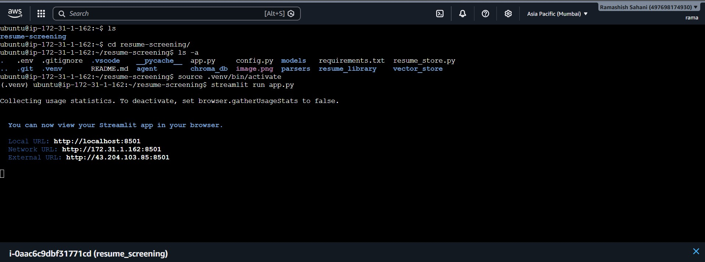
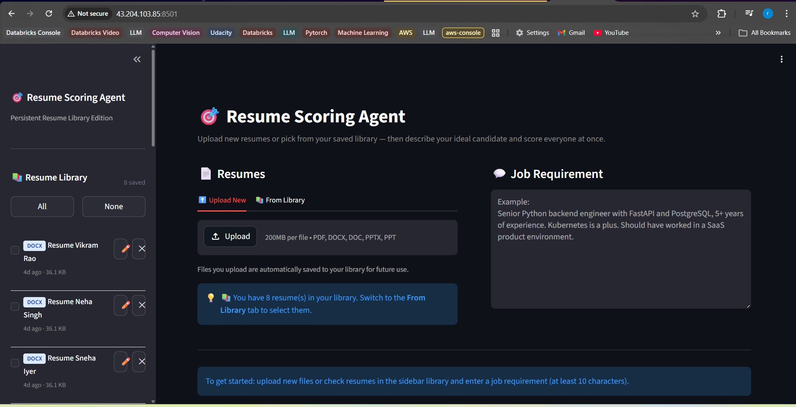
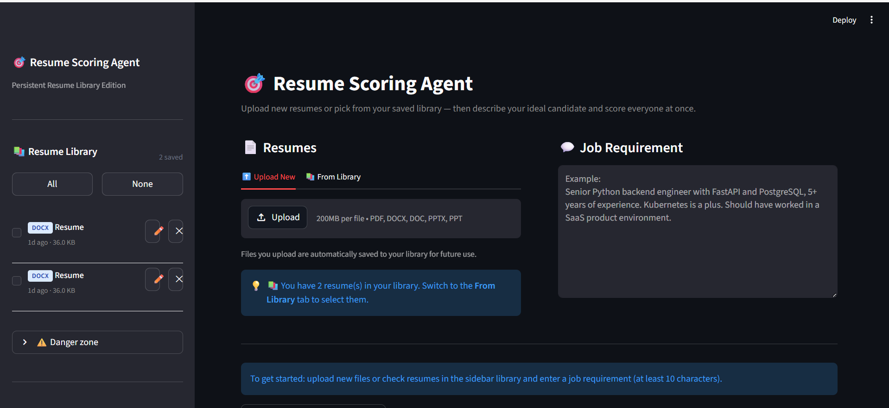
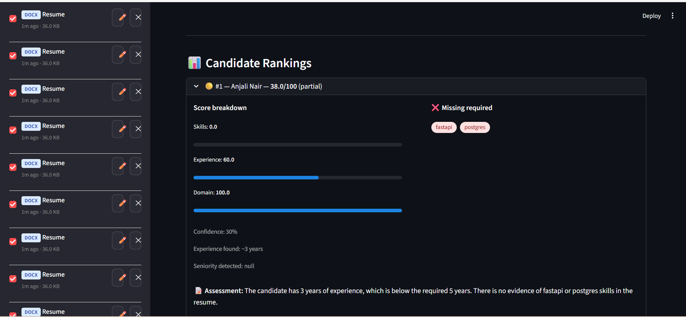
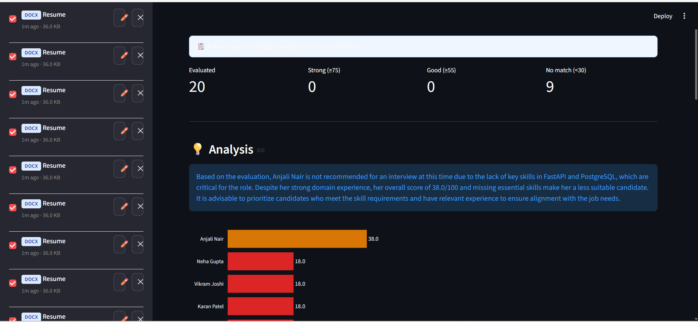

# 🎯 Resume Scoring Agent (POC)

An AI-powered multi-resume scoring and ranking system built with **LangGraph**, **LlamaIndex**, **LangChain**, **OpenAI**, **ChromaDB**, and **Streamlit**.

Upload resumes in PDF, DOCX, or PPTX format, describe your ideal candidate in plain English, and get a ranked, scored, explainable comparison of every candidate.

---

## Architecture Overview

```
Streamlit UI
     │
     ▼
LangGraph StateGraph
     │
     ├── Node 1: File Parsing       (pdfplumber / python-docx / python-pptx)
     ├── Node 2: LlamaIndex Indexing (chunk → embed → ChromaDB)
     ├── Node 3: Requirement Parser  (GPT-4o → ScoringRubric)
     ├── Node 4: Semantic Retrieval  (ChromaDB top-k per candidate)
     ├── Node 5: Scoring             (GPT-4o LLM-as-Judge per candidate)
     └── Node 6: Ranking             (sort + comparative summary)
```

---

## Quickstart

### 1. Clone / unzip the project

```bash
cd resume-agent
```

### 2. Create a virtual environment

```bash
python -m venv .venv
source .venv/bin/activate       # macOS/Linux
.venv\Scripts\activate          # Windows
```

### 3. Install dependencies

```bash
pip install -r requirements.txt
```

### 4. Configure environment

```bash
cp .env.example .env
# Edit .env and set your OPENAI_API_KEY
```

### 5. Run the app

```bash
streamlit run app.py
```

The app opens at `http://localhost:8501`.

---

## Project Structure

```
resume-agent/
├── app.py                        # Streamlit UI (upload → run → results → email)
├── config.py                     # Pydantic Settings (env-driven config)
├── email_sender.py               # Email drafting (GPT-4o) and SMTP sending
├── requirements.txt
├── .env.example
│
├── agent/
│   ├── graph.py                  # LangGraph StateGraph + run_agent()
│   ├── state.py                  # AgentState TypedDict
│   └── nodes/
│       ├── parser.py             # Node 1: file parsing + contact extraction
│       ├── indexer.py            # Node 2: LlamaIndex embedding + ChromaDB upsert
│       ├── requirement.py        # Node 3: rubric extraction from free text
│       ├── retriever.py          # Node 4: semantic retrieval per candidate
│       ├── scorer.py             # Node 5: LLM-as-Judge scoring
│       └── ranker.py             # Node 6: ranking + comparative summary
│
├── models/
│   ├── rubric.py                 # ScoringRubric Pydantic model
│   └── score.py                  # CandidateScore, ResumeDocument, RankedResult
│
├── parsers/
│   ├── __init__.py               # parse_resume() dispatcher
│   ├── pdf_parser.py             # pdfplumber
│   ├── docx_parser.py            # python-docx
│   └── pptx_parser.py            # python-pptx
│
└── vector_store/
    └── chroma_client.py          # ChromaDB wrapper (upsert, query, delete)
```

---

## How Scoring Works

Each candidate is scored on **three dimensions**:

| Dimension | What it measures |
|---|---|
| **Skills** | How many required/preferred skills are present in the resume |
| **Experience** | Years of experience and seniority level match |
| **Domain** | Relevance to the target industry or technical domain |

The **overall score** is a weighted average. Default weights:
- Skills: 50%
- Experience: 30%
- Domain: 20%

Weights are adjustable in the sidebar at runtime.

### Match Levels

| Level | Score | Meaning |
|---|---|---|
| 🟢 Strong | ≥ 75 | Excellent match — prioritise for interview |
| 🔵 Good | ≥ 55 | Solid match — worth a conversation |
| 🟡 Partial | ≥ 35 | Some overlap — may need further review |
| 🟠 Weak | ≥ 1 | Few matches — likely not suitable |
| 🔴 No match | < 30 | Insufficient evidence of fit |

---

## Supported File Formats

| Format | Parser | Notes |
|---|---|---|
| `.pdf` | pdfplumber | Multi-column, tables, text-layer PDFs |
| `.docx` | python-docx | Full formatting, tables, headers/footers |
| `.pptx` | python-pptx | Slide-by-slide extraction, tables |

> ⚠️ **Scanned PDFs** (image-only, no text layer) will extract very little text. Results will be flagged as low-confidence. Use Azure Document Intelligence or AWS Textract for OCR in production.

---

## Configuration Reference

| Variable | Default | Description |
|---|---|---|
| `OPENAI_API_KEY` | required | Your OpenAI API key |
| `LLM_MODEL` | `gpt-4o` | Chat model for scoring and rubric extraction |
| `EMBEDDING_MODEL` | `text-embedding-3-small` | Embedding model |
| `LLM_TEMPERATURE` | `0.1` | Lower = more consistent scores |
| `CHUNK_SIZE` | `512` | Token size per resume chunk |
| `CHUNK_OVERLAP` | `50` | Overlap between chunks |
| `TOP_K_RETRIEVAL` | `8` | Number of chunks retrieved per candidate |
| `MIN_SCORE_THRESHOLD` | `30` | Scores below this are flagged as "no match" |
| `SCORING_RUNS` | `1` | Set to 3 for self-consistency averaging (prod) |
| `CHROMA_PERSIST_DIR` | `./chroma_db` | Where ChromaDB stores its data |
| `SMTP_HOST` | `smtp.gmail.com` | SMTP server hostname |
| `SMTP_PORT` | `587` | SMTP port (587 for STARTTLS) |
| `SMTP_USER` | — | Your sender email address |
| `SMTP_PASSWORD` | — | SMTP password or app password |
| `SMTP_FROM_NAME` | `Resume Scoring Agent` | Display name on outgoing emails |

---

## Production Upgrade Path

| Component | POC | Production |
|---|---|---|
| Vector DB | ChromaDB (local) | Pinecone / Weaviate (hosted, multi-tenant) |
| UI | Streamlit | FastAPI + React |
| File parsing | pdfplumber | + Azure Document Intelligence (OCR) |
| Auth | None | OAuth2 / SSO |
| Job queue | Synchronous | Celery + Redis |
| Observability | loguru | LangSmith + Datadog |
| Scoring consistency | 1 run | 3 runs (self-consistency averaging) |
| Caching | None | Redis (embedding cache, score cache) |

---

## Example Usage

1. Upload 5 candidate resumes (mix of PDF and DOCX)
2. Enter: `"Senior data scientist with Python, PyTorch, and MLOps experience. Minimum 4 years. Knowledge of Kubernetes and AWS is a plus."`
3. Click **Score Candidates**
4. View ranked results with:
   - Overall score and match level per candidate
   - Skills matched vs. missing
   - GPT justification per candidate
   - Comparative summary across all candidates
   - Export to CSV
5. Reach out to candidates directly from the results screen (see [Candidate Outreach via Email](#candidate-outreach-via-email))

---

## Candidate Outreach via Email

After scoring, you can send personalised outreach emails to candidates without leaving the app. Emails are drafted by GPT-4o using each candidate's actual score, matched skills, and the job requirement — so every message is unique to that person.

### Step 1 — Add SMTP credentials to `.env`

```env
SMTP_USER=you@gmail.com
SMTP_PASSWORD=your-app-password
SMTP_HOST=smtp.gmail.com
SMTP_PORT=587
```

> **Gmail users:** do not use your regular Gmail password. Go to **Google Account → Security → App Passwords** and generate a dedicated app password for this project.

### Step 2 — Set up your email signature

Open the app and scroll down the left sidebar to the **✍️ Email Signature** section. Fill in your:

- Name
- Position / job title
- Company
- Phone number
- Contact email

A live preview updates as you type. This signature is automatically appended to the bottom of every email you send — both individual and bulk.

### Step 3 — Send emails

There are two ways to send from the results screen:

#### Send to one candidate

Each candidate card has a **✉️ Send Email** button at the bottom. Click it and an inline compose form opens with:

- The candidate's email address pre-filled (extracted from their resume)
- Your signature already in the body

Click **🪄 Draft with AI** to have GPT-4o write a personalised message referencing the candidate's score, matched skills, and the job requirement. You can edit the draft freely before hitting **📤 Send**.

> The Send button is disabled if no email address was found in the candidate's resume.

#### Send to all candidates at once

Scroll below the candidate cards to the **📨 Send to All Candidates** section. It tells you exactly how many candidates have a valid email and lists anyone who will be skipped (no address found).

Click **Send Personalised Email to X Candidates**, confirm the prompt, and the app will:

1. Call GPT-4o to draft a unique email for each candidate
2. Append your signature to each message
3. Send all emails via SMTP, one by one
4. Show a progress bar while sending

A results summary appears when done, showing ✅ or ❌ for every candidate.

### How the AI drafts each email

The draft is tailored per candidate using:

| Input | Example |
|---|---|
| Candidate name | Sarah Johnson |
| Overall score | 84.5 / 100 |
| Match level | strong |
| Matched skills | Python, FastAPI, PostgreSQL |
| Missing skills | Kubernetes |
| Job requirement summary | Senior backend engineer, 5+ years… |

A strong candidate gets an enthusiastic, specific message. A weaker candidate gets a more measured, neutral tone. The sign-off is always omitted from the AI draft — your configured signature is appended separately, keeping it consistent.

### Contact detail extraction

Email addresses and phone numbers are automatically extracted from each resume during parsing. If a candidate's email is missing from their resume, you can still open the compose form and type the address in manually.

---

## Known Limitations

- ChromaDB data is **not shared across machines** — it's local to the filesystem
- Session data persists in `./chroma_db` until manually deleted or session reset
- Scanned/image PDFs require OCR preprocessing
- Very long resumes (>15 pages) may need larger chunk sizes
- Parallel scoring within a single agent run is sequential in POC (LangGraph `Send` API for true parallelism is the production upgrade)

### Hosted App in aws EC2 instance

## Snaps Of UI






